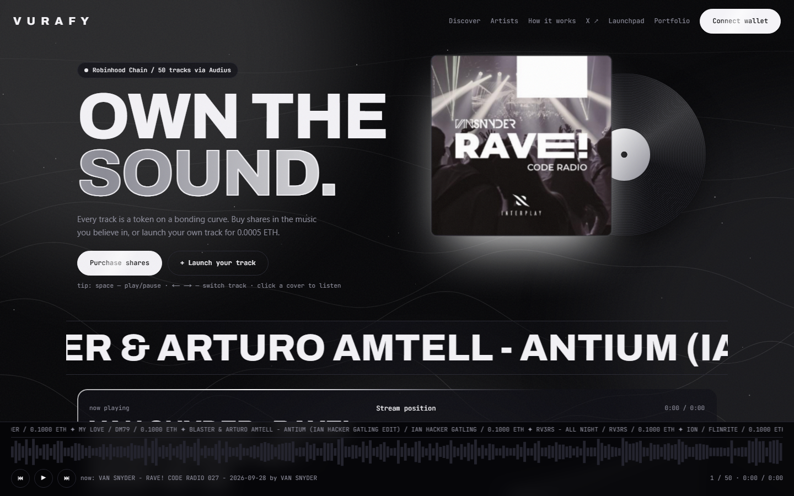
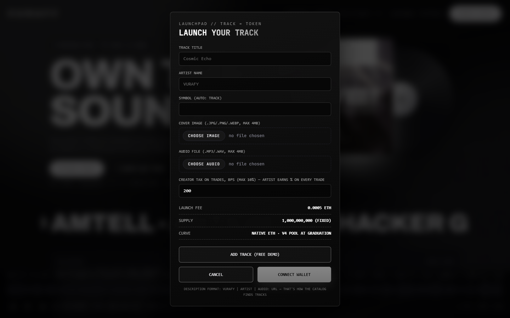
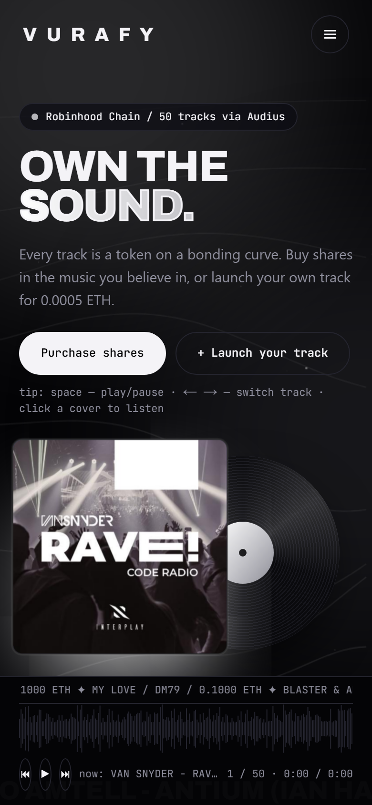
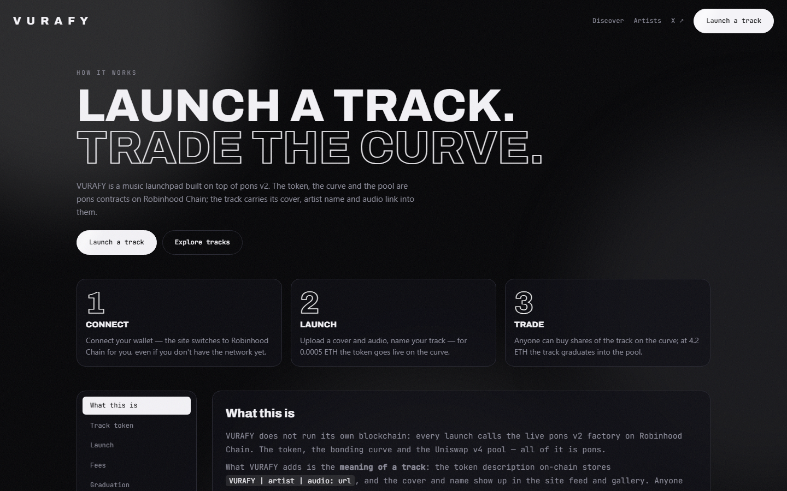
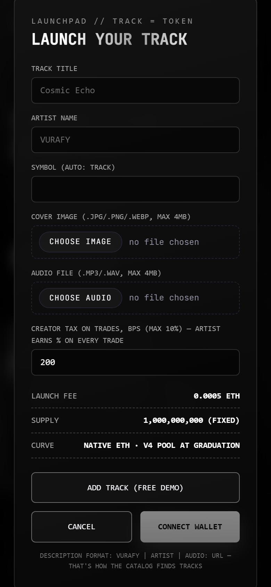

# VURAFY — every track is a token

**Live: [vura.ink](https://vura.ink)**

Launch your music as an on-chain token, let the market trade it on a bonding curve, and earn a share of every trade. Built on [pons v2](https://docs.ponsfamily.com/docs/v2) / Robinhood Chain (chainId **4663**).



## What is VURAFY

- **Track = token.** Launch a track for **0.0005 ETH** through the pons v2 factory — it becomes a tradeable token with its own bonding curve.
- **Trade the music you believe in.** Buy shares of any track, sell any time; the curve prices it until graduation.
- **Creator tax.** Set up to 10% creator tax on every trade — the artist earns on secondary volume, automatically.
- **Graduation.** At the target market cap the curve migrates to a **Uniswap v4 pool** with native ETH.
- **Listen for free.** The feed streams trending tracks from Audius — no wallet needed to play.

## Screenshots

| Launchpad | Mobile |
|---|---|
|  |  |

| How it works | Launch on mobile |
|---|---|
|  |  |

## Features

- 🎵 Streaming player — trending Audius feed + on-chain launches, waveform scrubbing, MediaSession lock-screen controls
- 🚀 Launchpad — upload cover + audio, they are pinned to **IPFS via Pinata**, then `launchToken` on-chain in one click
- 📈 Live bonding-curve trading — quotes, slippage and snipe-tax preview, buy/sell with wallet
- 🆓 Free demo mode — add a track locally (files stay in the browser, no wallet, no tx)
- 📱 Mobile-first — burger menu, safe-area dock player, touch-friendly controls
- 🔗 WalletConnect + injected wallets, auto network switch to Robinhood Chain

## Stack

| Layer | Tech |
|---|---|
| Framework | Next.js 14 (App Router), React 18, TypeScript |
| Styling | Tailwind CSS + custom design system (dark, mono, canvas background) |
| Web3 | wagmi + viem, WalletConnect |
| Contracts | pons v2 factory `0x7eD598BcEf8bd9Edd8C97A195C6d13f40801EC7e`, Robinhood Chain `4663` |
| Catalog | Audius trending API (fast path) + factory event scan (on-chain truth) |
| Media storage | Pinata IPFS (primary), Vercel Blob / catbox / uguu (image fallbacks) |
| RPC | same-origin proxy `/api/rpc` → `rpc.mainnet.chain.robinhood.com` |
| Hosting | Vercel |

## Quick start

```bash
npm install --legacy-peer-deps
npm run dev          # http://localhost:3000
```

Create `.env.local`:

```bash
# required for cover/audio uploads (Pinata IPFS)
PINATA_JWT=eyJhbGciOi...

# optional
NEXT_PUBLIC_GATEWAY_URL=https://gateway.pinata.cloud/ipfs/   # default
NEXT_PUBLIC_WALLETCONNECT_PROJECT_ID=...                     # WalletConnect
NEXT_PUBLIC_AUDIUS_API_KEY=...                               # falls back to a public key
BLOB_READ_WRITE_TOKEN=...                                    # image fallback if Pinata is down
```

### Scripts

```bash
npm run dev        # dev server on :3000
npm run typecheck  # tsc --noEmit
npm run lint       # next lint
npm run build      # production build
npx vercel --prod --yes   # deploy
```

## How a launch works

1. User picks a **cover image** (.jpg/.png/.webp, max 4 MB) and an **audio file** (.mp3/.wav, max 4 MB).
2. On submit both files are POSTed to `/api/upload` → pinned to **Pinata IPFS** (status: *Uploading media to IPFS…*).
3. The returned gateway URLs go into the pons v2 `launchToken` call — cover as `logo`, audio URL inside the track description (`vurafy | artist | audio: url` — that's how the catalog parses tracks).
4. After the transaction confirms the form resets and the catalog re-scans; the track appears in the feed.

The catalog reads the factory description format to recover `artist` and `audio` — keep that format if you build your own client.

## Routes

| Route | Purpose |
|---|---|
| `/` | VURAFY main page — feed, player, launchpad |
| `/vurafy` | app (same as `/`) |
| `/vurafy/how` | how it works |
| `/api/upload` | pin media to IPFS (Pinata, image fallbacks) |
| `/api/rpc` | same-origin JSON-RPC proxy |

## Links

- Product: [vura.ink](https://vura.ink)
- pons v2 docs: [docs.ponsfamily.com](https://docs.ponsfamily.com/docs/v2)
- X: [@vurafy](https://x.com/vurafy)
